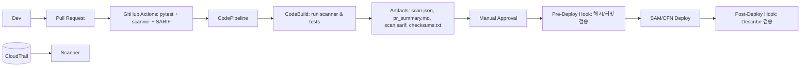

    

# Serverless Guardrails — Lambda 안전벨트

## 목차(TOC)
- [1) 소개(Overview)](#1-소개overview)
- [2) 빠른 시작(Quick Start)](#2-빠른-시작quick-start)
- [3) 설정/구성(Configuration)](#3-설정구성configuration)
- [4) 아키텍처(Architecture)](#4-아키텍처architecture)
- [5) 스캐너 사용법(Scanner Usage)](#5-스캐너-사용법scanner-usage)
- [6) CI/CD 파이프라인(CI/CD & Pipeline)](#6-cicd-파이프라인cicd--pipeline)
- [7) 보안·컴플라이언스(Security & Compliance)](#7-보안컴플라이언스security--compliance)
- [8) 운영(Operations)](#8-운영operations)
- [9) 기여 가이드(Contributing)](#9-기여-가이드contributing)
- [10) 라이선스(License) & 보안 정책(Security Policy)](#10-라이선스license--보안-정책security-policy)
- [11) 변경 이력(Changelog)](#11-변경-이력changelog)
- [부록 A) 예제 Make 타겟](#부록-a-예제-make-타겟)

## 1) 소개(Overview)
AWS Lambda 배포 전 누락되기 쉬운 환경변수 비밀 노출, IAM 과권한, 무제한 VPC egress와 같은 서버리스 보안 리스크를 정적 스캔과 파이프라인 게이트로 차단합니다. 보안/SRE 팀은 파이프라인의 각 게이트에서 동일한 스캔 결과를 참고하고, 개발자는 5분 내 재현 가능한 절차로 취약점을 교정할 수 있습니다.

- 정적 스캐너(`scanner/`) — 룰: `env_secret`, `iam_leastpriv`, `vpc_egress`
- 데모 Lambda(`functions/`): `vulnerable/` 취약 예시 vs `safe/` 모범 예시
- SAM 템플릿(`templates/`) + 파이프라인 정의(`pipeline/`)
- CI 요약 코멘트 & SARIF 출력(코드 스캐닝 통합)
- Pre/Post Deploy Hook으로 스캔 우회 방지

데모 스크린샷: `docs/img/demo.png` (업데이트 예정) / 데모 링크: `https://example.com/serverless-guardrails-demo`

## 2) 빠른 시작(Quick Start)
필수 조건
- Python 3.11, AWS CLI, SAM CLI
- `jq` (선택) — SARIF/요약 변환 자동화 시 사용
- 최소 IAM 권한 개요: SAM 배포(`cloudformation:*` 제한형, `lambda:*` 일부), `iam:PassRole`, `s3:GetObject/PutObject`, `logs:PutLogEvents`

가상환경 생성/활성화 + 의존성 설치
- Linux/macOS
  ```bash
  python3.11 -m venv .venv && source .venv/bin/activate
  pip install -r requirements.txt
  ```
- Windows (PowerShell)
  ```powershell
  py -3.11 -m venv .venv; .\.venv\Scripts\Activate.ps1
  pip install -r requirements.txt
  ```

취약 버전 스캔(실패 기대)
- Linux/macOS
  ```bash
  python -m scanner --template templates/app-sam.yaml \
    --source functions/vulnerable \
    --format json --out artifacts/scan.json
  echo $?   # 2 이어야 함
  ```
- Windows (PowerShell)
  ```powershell
  python -m scanner --template templates/app-sam.yaml \
    --source functions/vulnerable \
    --format json --out artifacts/scan.json
  echo $LASTEXITCODE   # 2 이어야 함
  ```

안전 버전 스캔(통과 기대)
- Linux/macOS
  ```bash
  python -m scanner --template templates/app-sam.yaml \
    --source functions/safe \
    --format json --out artifacts/scan.json
  echo $?   # 0 이어야 함
  ```
- Windows (PowerShell)
  ```powershell
  python -m scanner --template templates/app-sam.yaml \
    --source functions/safe \
    --format json --out artifacts/scan.json
  echo $LASTEXITCODE   # 0 이어야 함
  ```

테스트 실행
- Linux/macOS
  ```bash
  pytest --cov=scanner --cov-report=term-missing --cov-fail-under=80
  ```
- Windows (PowerShell)
  ```powershell
  pytest --cov=scanner --cov-report=term-missing --cov-fail-under=80
  ```

(선택) SAM 배포 및 정리
- Linux/macOS
  ```bash
  sam build
  sam deploy --guided --stack-name serverless-guardrails-demo
  sam delete --stack-name serverless-guardrails-demo
  ```
- Windows (PowerShell)
  ```powershell
  sam build
  sam deploy --guided --stack-name serverless-guardrails-demo
  sam delete --stack-name serverless-guardrails-demo
  ```

## 3) 설정/구성(Configuration)
`.env.example` (실제 비밀 금지):
| 키 | 예시 | 설명 |
|---|---|---|
| AWS_REGION | ap-northeast-2 | 기본 배포 리전 |
| LOG_LEVEL | INFO | 스캐너 및 훅 로깅 레벨 |
| FAIL_ON | MEDIUM | CodeBuild 실패 임계값(MEDIUM/HIGH) |
| ALLOWLIST_FILE | .guardrails-allow.json | 예외 허용 목록 파일 경로 |

필수 AWS 권한(최소권한 요약)
- 스캐너/CodeBuild: `s3:GetObject`, `s3:PutObject`, `logs:CreateLogStream`, `logs:PutLogEvents`
- SAM/CloudFormation: `cloudformation:CreateChangeSet`, `cloudformation:ExecuteChangeSet`, `lambda:UpdateFunctionConfiguration`, 제한된 `iam:PassRole`
- PreDeploy Hook: `codepipeline:GetPipelineState`, `s3:GetObject`
- PostDeploy Hook: `lambda:ListFunctions`, `cloudformation:DescribeStacks`

환경별 차이
- dev:  `FAIL_ON=MEDIUM`, Allowlist 자동 갱신 허용
- stage:  Allowlist 변경 시 보안 리뷰 필수, 만료 7일 전 알림
- prod:  Allowlist `expiresAt` 경과 시 배포 중단, Manual Approval에서 최고 경보 반드시 확인

## 4) 아키텍처(Architecture)


아티팩트 흐름
- `scan.json`: 스캐너 결과(Pre-Deploy 해시 검증 대상)
- `pr_summary.md`: GitHub 코멘트용 요약
- `scan.sarif`: 코드 스캐닝(SARIF 업로드용)
- `checksums.txt`: `scan.json` SHA256 및 커밋 SHA 기록

주요 컴포넌트
| 디렉터리 | 역할 |
|---|---|
| `scanner/` | Python 3.11 정적 분석기 및 CLI |
| `functions/` | 취약/안전 Lambda 샘플 소스 |
| `templates/` | SAM 템플릿(`app-sam.yaml`) |
| `pipeline/` | CodePipeline 스택 및 `buildspec.yml` |

## 5) 스캐너 사용법(Scanner Usage)
CLI 옵션
| 옵션 | 설명 |
|---|---|
| `--template` | 참조 SAM/CloudFormation 템플릿 경로 |
| `--source` | 스캔 대상 소스 디렉터리 |
| `--format {json|sarif}` | 출력 포맷 선택 |
| `--out` | 결과 저장 경로 |

출력 JSON 예시
```json
{
  "summary": {"critical": 0, "high": 1, "medium": 2, "low": 0, "info": 1},
  "findings": [
    {
      "id": "iam_leastpriv::lambda-exec",
      "severity": "high",
      "resource": "MyFunctionRole",
      "message": "IAM 정책에 Action '*' 와 Resource '*' 조합이 포함되어 있습니다.",
      "recommendation": "필요 서비스/리소스로 범위를 축소하거나 조건을 추가하세요."
    }
  ],
  "passed": false
}
```

종료코드 규칙
| 코드 | 조건 |
|---|---|
| 2 | critical/high 존재 |
| 1 | medium만 존재 |
| 0 | low/info만 존재 |

룰 개요
- **env_secret**: 환경변수/템플릿에서 AccessKey, JWT, RSA 등 의심 문자열을 탐지합니다. Secrets Manager 또는 SSM Parameter Store(KMS CMK 암호화)로 이전하세요.
- **iam_leastpriv**: `Action`/`Resource` 와일드카드, `iam:*`, `kms:*`, `s3:*` 등 고위험 권한을 탐지하며 최소권한 정책 스니펫을 제안합니다.
- **vpc_egress**: SG egress `0.0.0.0/0`, 인터넷 게이트웨이 라우트, 퍼블릭 서브넷 연결을 식별하고 Interface VPC 엔드포인트/egress 프록시 구성을 권장합니다.

## 6) CI/CD 파이프라인(CI/CD & Pipeline)
전체 흐름: PR 생성 → GitHub Actions(테스트+스캔+SARIF/PR 코멘트) → CodePipeline(CodeBuild 스캔) → **Pre-Deploy 해시 검증** → Manual Approval → SAM/CFN Deploy → Post-Deploy 검증.

CodeBuild `buildspec.yml` 핵심 단계
| 단계 | 작업 |
|---|---|
| `pre_build` | `.env.example` 로 환경 구성, 의존성 설치, Allowlist 만료 검사 |
| `build` | `python -m scanner`, `pytest` 실행, `FAIL_ON` 임계값 적용 |
| `post_build` | `scan.json`, `scan.sarif`, `pr_summary.md`, `checksums.txt` 업로드 |

주요 환경 변수: `FAIL_ON`, `ALLOWLIST_FILE`, `CODEBUILD_RESOLVED_SOURCE_VERSION`.

Manual Approval Gate
- Slack/이메일 알림에 high 이상 상위 N개 findings, 수정 가이드 링크(`docs/DEMO.md#remediation`) 포함
- 승인자는 `checksums.txt`의 `sha256(scan.json)`과 커밋 SHA 일치 여부 확인

Pre-Deploy Hook
- `checksums.txt` 기반 `scan.json` SHA256 검증
- `CODEPIPELINE_EXECUTION_ID` → 소스 커밋 SHA 불일치 시 즉시 실패

Post-Deploy Hook
- `aws lambda list-functions`, `aws cloudformation describe-stacks` 호출
- 스캔 당시 환경변수/VPC 설정이 배포 결과와 동일한지 검증

파이프라인 아티팩트
- `artifacts/scan.json`
- `artifacts/scan.sarif`
- `artifacts/pr_summary.md`

## 7) 보안·컴플라이언스(Security & Compliance)
- 비밀 관리: Secrets Manager 또는 SSM Parameter Store + KMS CMK 사용, 저장소에는 `.env.example` 가짜 값만 허용합니다.
- 최소권한: `Action`/`Resource` `"*"` 금지, `iam:PassRole`, `kms:Decrypt`, `s3:GetObject` 등은 조건(`aws:SourceArn`, `kms:ViaService`)을 적용합니다.
- VPC egress 통제: SG egress `0.0.0.0/0 ANY` 차단, Interface VPC 엔드포인트 또는 프라이빗 프록시 사용을 권장합니다.
- 예외(Allowlist) 정책: `.guardrails-allow.json` 항목에 `reason`, `owner`, `expiresAt`(ISO8601) 필드가 필수이며 만료 시 CI가 실패합니다.
- 컴플라이언스 매핑: NIST SP 800-53(AC-6, SC-7, SA-11, CM-3), ISO/IEC 27001(A.9, A.12.6, A.14), AWS Well-Architected Security(Identity, Data, Network, Change).

## 8) 운영(Operations)
- 로그/모니터링: CodeBuild/Hook/Lambda 로그를 CloudWatch Logs에 180일 보존, `AccessDenied` 급증 Metric Filter + SNS 알림 구성.
- 헬스체크/런북: `docs/RUNBOOK.md` (placeholder)에서 공통 장애 대응 절차 확인.
- 장애 시 3단계 요약
  1. CodeBuild 및 Pre/Post Hook 로그에서 오류와 타임라인 확인
  2. `checksums.txt` vs `scan.json` 해시, Manual Approval 이력 검토
  3. 이전 릴리스 롤백: `sam delete --stack-name serverless-guardrails-demo && sam deploy --stack-name previous-stack --template-file artifacts/last_good_template.yaml`
- FAQ
  - Q: 스캐너가 Lambda ARN을 추론하지 못합니다.  
    A: SAM 템플릿에 `FunctionName`과 `Role`을 명시하거나 `--template` 옵션에 전체 경로를 지정하세요.
  - Q: Allowlist가 오탐 때문에 필요합니다.  
    A: `.guardrails-allow.json`에 항목을 추가하되 `expiresAt`을 단기 설정하고 PR 설명에 근거를 기록하세요.
  - Q: IAM 정책이 크기 한도를 초과합니다.  
    A: 정책을 모듈화하거나 `ManagedPolicyArns`를 사용하고, 룰 예외 시 별도 보안 검토 워크플로를 요청하세요.

## 9) 기여 가이드(Contributing)
- 브랜치 전략: `main` 보호, 모든 변경은 PR을 통해 진행, 최소 1인 리뷰 후 머지
- 코드 스타일 및 정적 검사: Python `black`, `ruff`, 테스트는 `pytest`(커버리지 ≥80%)
- 커밋 규칙: Conventional Commits (`feat:`, `fix:`, `chore:` 등), PR 템플릿에 테스트 증빙 첨부
- pre-commit 훅
  ```bash
  pre-commit install
  pre-commit run --all-files
  ```

## 10) 라이선스(License) & 보안 정책(Security Policy)
- 라이선스: TBD (LICENSE 링크 예정)
- 취약점 신고: `SECURITY.md` 또는 `security@example.com`으로 책임 있는 공개 절차 진행

## 11) 변경 이력(Changelog)
- 릴리스 노트: `RELEASES/CHANGELOG.md` (placeholder)
- 버전 관리: SemVer(`vMAJOR.MINOR.PATCH`) 원칙 준수

## 부록 A) 예제 Make 타겟
```Makefile
make init        # venv+의존성 설치
make scan-vuln   # vulnerable/ 소스 스캔 → 실패 기대
make scan-safe   # safe/ 소스 스캔 → 통과 기대
make test        # pytest + 커버리지
make deploy      # sam build/deploy (옵션)
make destroy     # sam delete
```
